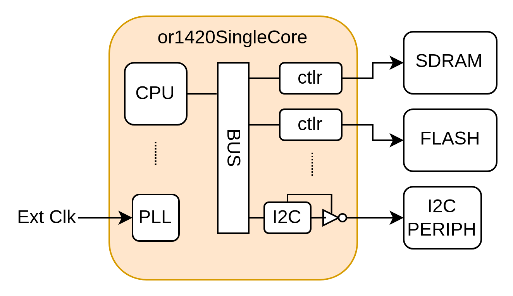
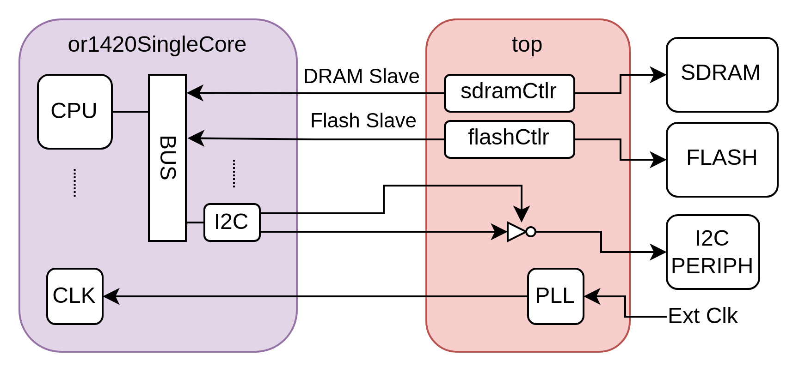
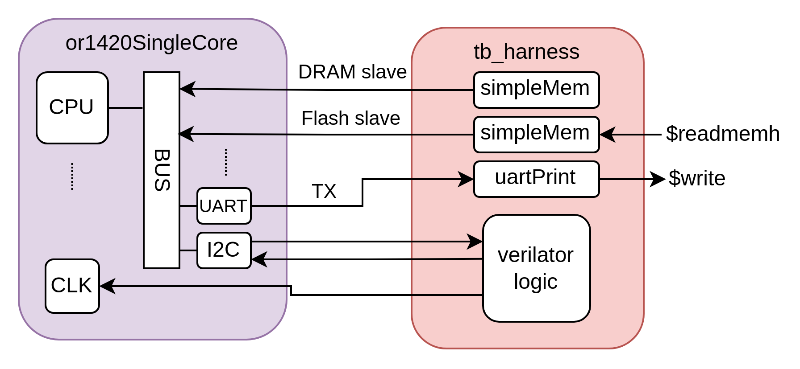
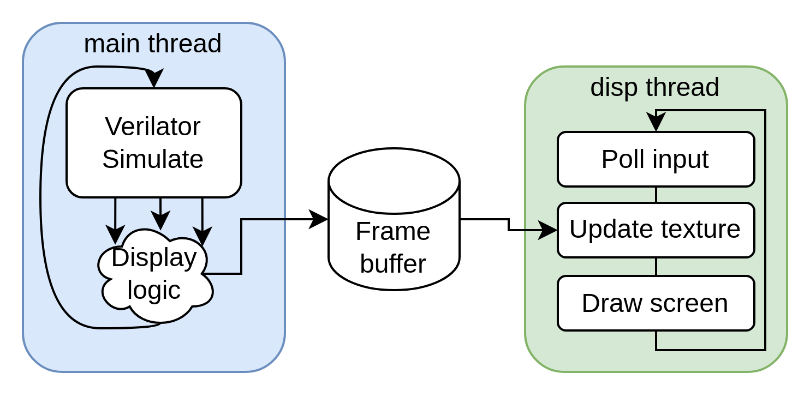
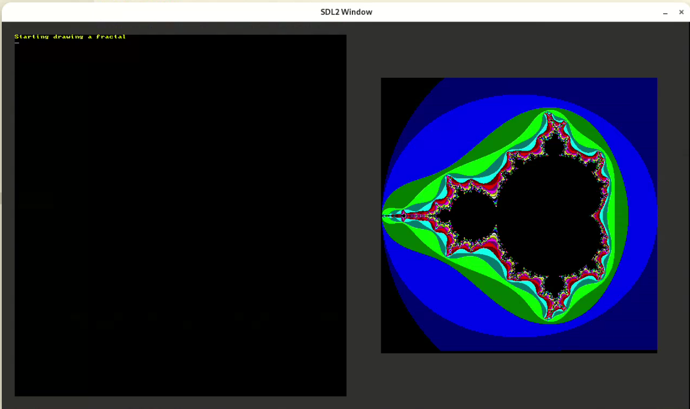

# CS476 Final Project: Virtual Prototype Simulation

Team Members:
* Cemalettin Cem Belentepe
* Julien de Castelnau

# Repo Structure

* `grayscale/`, `grayscaleNonDMA`: grayscale apps from the PWs
* `virtualPrototype`:
  * `modules`: Verilog modules from before.
    * Changed: `bios` module has a Makefile for building other BIOS programs. Check the [readme in the bios directory](./virtualPrototype/modules/bios/README.md) for more
  * `programs`: Programs as before
  * `systems/singleCore`: single core directory as before
    * `tb`: contains simulation Makefiles, C++ code, top-level Verilog wrappers

# Building/Running

See the [readme in the tb directory](./virtualPrototype/systems/singleCore/tb/README.md) for details.

# Project Description

Our simulation project aims to address 4 primary concerns about the virtual prototype as it is today, with no simulation model available:

* Reproducibility
  * For FPGAs, different synthesis runs produce potentially very different circuits from small changes in the source. When timing constraints are at play, this can become a functional issue. For example, different runs may not produce equivalent critical paths, causing constraints to be violated.
* Visibility
  * Debugging on hardware necessarily involves the use of some extra circuit to write to an interface such as JTAG, UART, etc. Not only do these interfaces provide limited bandwidth to observe problems in the system, but the circuits to facilitate them also incur utilization overhead in the FPGA. This problem is compounded when timing slack is already tight: the addition of a debugging circuit itself can cause incorrect behavior due to timing violations, making the system impossible to debug.
* Iteration speed
  * FPGA synthesis & place-and-route algorithms are computationally expensive and tend to incur long build times. This makes it difficult to quickly iterate on buggy designs.
* Portability
  * The current top-level module contains a mix of portable logic (e.g. bus architecture) and non-portable logic (e.g. PLLs). Separating the system into a maximally simulatable (thus portable) subset makes porting to other platforms eaiser. 

## Challenges

The following are challenges we faced when creating this simulation model:

* Non-simulatable constructs:
  * Certain circuits like tristates or PLLs pose problems for simulation, especially in our simulator of choice, Verilator, which does not simulate 4-state logic (0,1,X,Z) for performance reasons. 
* External peripherals
  * On-board peripherals such as SDRAM, flash, HDMI, need to be simulated to run practical software on the simulated virtual prototype. They also should be accurate, otherwise the software may behave differently.
* Simulation speed
  * Simulation is at least an order of magnitude slower than hardware. Faster simulators which sacrifice some accuracy like Verilator help, but measures should be taken to speed up some system peripherals which only have acceptable speed in realtime.

## Solution: Non-simulatable constructs

For this, we separated out the synthesis-only components of `or1420SingleCore` into a new module, `top`. Here is a diagram of the system before:

After splitting:

Note the movement of the tristate and PLL out of the module. We have also separated out the SDRAM and flash controller which we discuss next.

We did some preliminary verification on this change by running our grayscale conversion application (w/ DMA) on the FPGA. 

## Solution: External Peripherals

The diagram below shows how the same or1420SingleCore is interfaced with in simulation. We drive some peripherals using Verilog simulation models and others using C++ (with  Verilator.) We discuss each below.

### SDRAM + Flash

We decided to externalize the SDRAM and flash interfaces themselves, in favor of simulating only the interactions on the bus. We accomplished this with a generic bus slave ("simpleMemorySlave") containing a simple single-cycle memory, with configurable size and start address options. For the flash, which we wound up using to load programs, we also provided an option to preload the memory using $readmemh.

The primary motivation for this architecture is due to the intricacy of these peripherals; the bus provides a useful abstraction to maintain functionality as if the peripherals were there, without having to implement their original behavior exactly (to match with what the controller expects). Of course, this sacrifices accuracy, though it is more portable: if we were to change platforms, the simulation models for each peripheral would change completely and likely little would be reusable. To cope with the accuracy loss, which is mainly due to assuming constant single-cycle access latency, one can also add configurable delay lines which delay the signal and raise busy to simulate stalling. SDRAM refreshes can also be modeled with a counter and state machine that pauses all inflight transactions. Due to time constraints we were not able to implement these features in the slave.

### UART

We chose to implement an RX-only UART for simplicity, using a simple Verilog module (uartPrint) which calls $write on received characters. That is to say, the simulation can print the output from the core, but it cannot send characters to it. The typical usage for sending characters is in loading programs, but the flash can be used instead (more later.)

### HDMI

We used the SDL2 graphics library to implement a screen inside our C++ Verilator simulation. To avoid coupling the hardware simulation speed to the display update logic, we put the display code in another thread and set the pixels to a framebuffer in shared memory. The simulation thread reads directly from the video signals which would normally go to the breakout board (RGB, vsync, hsync); thus the display peripheral is exactly as it is on hardware.

Screenshot of the simulated screen displaying Mandlebrot fractal:

### Camera/I2C

We started work on the Camera interface, but have not gotten it working. This includes the I2C used to write to the device's registers; we verified this component working correctly at least. The camera's standard output logic is implemented in C++. Most likely, the issue is that the system does not yet simulate clocks which are not a multiple of the system clock (which corresponds to the HDMI pixel clock and clockX2). The camera outputs a clock which is at a different frequency; running it at the system clock appears to not work as intended.

## Solution: Simulation Speed

Rough measurements indicate that the system, including all the aforementioned peripherals, is around 100x slower in simulation than realtime. From our experimemnts, this is arguably fast enough to be useful for screen displaying and UART printing (at the same baud rate). However, some back-of-the-envelope calculations (100x slowdown * 115200 baud * ~8kB program = ~1 minute) suggest that program loading would be too slow over UART, defeating the goal of fast iteration. Thus, as mentioned before, we instead preload the program into simulated flash memory using $readmemh. As the BIOS expects the size of the program to be present in the second word of memory, we made a Python script to automatically convert a mem file generated by the software build scripts to the appropriate format. This is invoked automatically by the makefile when running simulation.

## Miscellaneous accomplishments

* Resolve Verilog undefined behavior:
  * There were some instances in the virtual prototype source where blocking assignments were used in synchronous always blocks, and non-blocking in asynchronous blocks. While generally inferred correctly by synthesis tools, they can be problematic in simulation as different simulators interpret them differently. We observed some incorrect behavior while running in Verilator specifically, and adjusted the design to use the corresponding assign statements so that the behavior was conformant to conventions.

* BIOS compilation: 
  * We added a simple Makefile system to allow the compilation of other programs to the BIOS ROM, primarily to test CPU features without having to load the whole BIOS.
  * This can also be used for running preset commands in the BIOS without having access to the UART. We have an example of this workflow in `simBios.c`.

* ModelSim/QuestaSim scripts:
  * As part of resolving the undefined behavior mentioned above, we added scripts to test the design in another simulator, ModelSim. Of course, this does not allow for the simulation of C++ peripherals like the HDMI, and it is much slower, but it was useful for us to compare traces when Verilator was not giving the intended result.

* Configurable options:
  * The simulation script has a range of configurable options like enabling/disabling vcd tracing, setting simulation limits, etc. As previously mentioned these are documented in [the readme](./virtualPrototype/systems/singleCore/tb/README.md).
